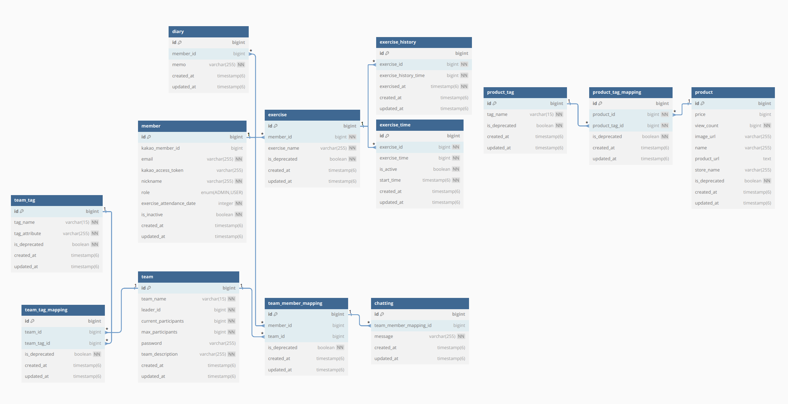

## 홈트라이
**그룹원들과 홈트 시간을 공유하며 쉽고 꾸준한 운동 습관을 길러주는 홈트 플랫폼**


<br />

### 목차
- [팀 내 배포 링크](#팀-내-배포-링크)
- [개발 동기 및 목적](#개발-동기-및-목적)
- [서비스 소개](#서비스-소개)
- [팀원 소개](#팀원-소개)
- [기술 스택](#기술-스택)
- [주요 기능](#주요-기능)
- [개발 주안점](#개발-주안점)
- [페이지별 기능](#페이지별-기능)
- [폴더 구조](#폴더-구조)

<br />

### 팀 내 배포 링크
[FE] https://hometry.vercel.app/

[BE] https://home-try.13.125.102.156.sslip.io

<br />

### 개발 동기 및 목적
홈트라이는 혼자 운동하기 어려운 이들을 위해, 함께 운동하는 느낌과 동기를 제공하는 홈트 플랫폼입니다. 코로나 이후 홈트 붐이 일어났지만 집에서 혼자 운동하다 보니 동기부여가 어렵고, 쉽게 포기할 수 있습니다. 홈트라이는 이러한 문제점을 해결하고자 시작되었습니다.
- **꾸준한 운동 습관 형성**
    - 운동 시간을 시각화하고 기록하여 매일 운동을 실천하도록 돕고, 그룹 내 랭킹 시스템과 채팅 기능을 통해 그룹원들과 소통하며 운동의 재미를 더합니다. 👏
- **건강한 커뮤니티 형성**
    - 그룹을 통해 운동 지식을 공유하고, 서로의 운동 성과를 인증하며 응원함으로써 건강한 커뮤니티 문화를 만들어갑니다. 💬
- **쉬운 접근성**
    - 모바일로 간편하게 운동 기록과 통계를 확인하고 실시간으로 운동에 참여할 수 있어 언제 어디서든 운동 습관을 기를 수 있습니다. 🌟


<br />

### 서비스 소개
그룹원들과 홈트 시간을 공유하며 쉽고 꾸준한 운동 습관을 길러주는 홈트 플랫폼, **홈트라이**
- 실시간으로 운동 시간을 측정하여 시각화를 통해, 혼자 집에서도 꾸준히 홈트를 진행하도록 동기 부여 🔥
- 매일 반복되는 운동 사이클 속 재미와 운동 습관 형성 ✨
- 그룹 내 랭킹 및 채팅 기능을 통해 그룹원들과 커뮤니케이션이 가능하며, 새로운 운동 지식과 오운완 인증까지! 💪🏻

<br />


### 팀원 소개
**FE**
| [정서윤(FE 테크리더)](https://github.com/yunn23) | [이도현](https://github.com/leedyun) |
|----------|----------|
| 로그인, 메인, 랭킹, 마켓, 마이페이지   | 로그인, 나의 그룹, 그룹 탐색, 채팅페이지 |

**BE**
| [정우재(팀장)](https://github.com/Woojae-Jeong) | [김수랑(BE 테크리더)](https://github.com/rdme0) | [박준형](https://github.com/cliant) | [조현서](https://github.com/hxunsc) |
|----------|----------|----------|----------|
| 나의 그룹, 그룹탐색 | 로그인, 채팅 | 메인  | 운동, 마켓  |


<br />

### 기술 스택


서버 사이드

 

데이터베이스


실시간 채팅

 

인증 및 보안


서버 사이드 렌더링

   

빌드 도구 및 배포

  


<br />

### 개발 문서
- [API 명세서](https://www.notion.so/zip-a9658fe9f60d405197cf314431d4f3c8?p=979bd88c8a8e4b15be3cc4d9d3ab0500&pm=s)
- [와이어 프레임](https://www.figma.com/design/TsCneAgt5ONEKWAiArCA6u/%EC%B9%B4%ED%85%8C%EC%BA%A0-%ED%99%88%ED%8A%B8%EB%9D%BC%EC%9D%B4-%EC%99%80%EC%9D%B4%EC%96%B4%ED%94%84%EB%A0%88%EC%9E%84_%EC%BF%A0%ED%82%A4zip?node-id=130-2033&t=idsBFD1mOYhPFPFk-1)
- erd


<br />

### 주요 기능


<br />


### 개발 주안점


<br />


### 페이지별 기능


| 분류              | 기능1                                  | 기능2                                 | 기능3                          | 기능4                         | 기능5      |
| ----------------- | --------------------------------------- | ------------------------------------- | ------------------------------ | ----------------------------- | ---------- |
| 로그인 페이지     | 카카오 소셜 로그인                     |                                       |                                |                               |            |
| 메인 페이지       | 날짜별 총 운동시간, 상세운동기록, 일기 조회 | 운동 추가, 삭제                      | 운동 시작, 종료               | 일기 작성, 삭제               |            |
| 나의 그룹 페이지  | 사용자가 가입하거나 만든 전체 그룹 조회 | 사용자가 가입한 그룹과 만든 그룹에 대한 필터링 | 그룹원들의 날짜별 운동시간에 대한 랭킹 조회 | 그룹 탈퇴                     |            |
| 그룹 탐색 페이지  | 전체 그룹 조회                         | 그룹 이름에 기반한 검색              | 그룹 태그를 이용한 필터링      | 비밀번호가 있으면 입력 후 그룹 가입, 없으면 바로 가입 | 그룹 생성 |
| 마켓 페이지       | 마켓 상품 조회                         | 상품 태그를 이용한 필터링            |                                |                               |            |
| 마이 페이지       | 닉네임 변경                            | 출석 일수, 운동 통계 조회            | 회원 탈퇴                      |                               |            |
| 관리자 로그인페이지 | 카카오 소셜 로그인                     |                                       |                                |                               |            |
| 관리자 상품 관리 페이지 | 상품 추가, 수정, 삭제                 |                                       |                                |                               |            |
| 관리자 상품 태그 관리 페이지 | 상품 태그 추가, 삭제                 |                                       |                                |                               |            |
| 관리자 팀 그룹 태그 관리 페이지 | 그룹 태그 추가, 삭제                 |                                       |                                |                               |            |


<br />


### 폴더 구조

```
src
├── main
│   ├── java
│   │   └── homeTry
│   │       ├── Application.java
│   │       ├── admin
│   │       │   ├── controller
│   │       │   │   ├── rest
│   │       │   │   │   └── AdminPageRestController.java
│   │       │   │   └── view
│   │       │   │       ├── AdminAuthorityController.java
│   │       │   │       ├── AdminMainPageController.java
│   │       │   │       └── AdminPageViewController.java
│   │       │   ├── dto
│   │       │   │   └── request
│   │       │   │       └── AdminCodeRequest.java
│   │       │   ├── exception
│   │       │   │   ├── AdminErrorType.java
│   │       │   │   └── badReqeustException
│   │       │   │       └── InvalidAdminCodeException.java
│   │       │   └── service
│   │       │       └── AdminPageService.java
│   │       ├── chatting
│   │       │   ├── config
│   │       │   │   └── ChattingConfig.java
│   │       │   ├── dto
│   │       │   │   ├── request
│   │       │   │   │   └── ChattingMessageRequest.java
│   │       │   │   └── response
│   │       │   │       └── ChattingMessageResponse.java
│   │       │   ├── endpointHandler
│   │       │   │   ├── async
│   │       │   │   │   └── ChattingMessageListener.java
│   │       │   │   └── rest
│   │       │   │       └── ChattingController.java
│   │       │   ├── exception
│   │       │   │   ├── ChattingErrorType.java
│   │       │   │   ├── badRequestException
│   │       │   │   │   ├── InactivatedMemberWithValidTokenException.java
│   │       │   │   │   ├── InvalidChattingTokenException.java
│   │       │   │   │   ├── InvalidTeamIdException.java
│   │       │   │   │   └── NoSuchMemberInDbWithValidTokenException.java
│   │       │   │   └── handler
│   │       │   │       ├── ChattingExceptionHandler.java
│   │       │   │       └── StompInterceptorErrorHandler.java
│   │       │   ├── interceptor
│   │       │   │   └── StompInterceptor.java
│   │       │   ├── model
│   │       │   │   ├── entity
│   │       │   │   │   └── Chatting.java
│   │       │   │   └── vo
│   │       │   │       └── Message.java
│   │       │   ├── repository
│   │       │   │   └── ChattingRepository.java
│   │       │   └── service
│   │       │       └── ChattingService.java
│   │       ├── common
│   │       │   ├── annotation
│   │       │   │   ├── DateValid.java
│   │       │   │   ├── LoginMember.java
│   │       │   │   ├── PasswordValid.java
│   │       │   │   └── validator
│   │       │   │       ├── DateValidator.java
│   │       │   │       └── PasswordValidator.java
│   │       │   ├── auth
│   │       │   │   ├── LoginMemberArgumentResolver.java
│   │       │   │   ├── exception
│   │       │   │   │   ├── AuthErrorType.java
│   │       │   │   │   ├── badRequestException
│   │       │   │   │   │   ├── InvalidAuthCodeException.java
│   │       │   │   │   │   └── InvalidTokenException.java
│   │       │   │   │   └── internalServerException
│   │       │   │   │       ├── HomeTryServerException.java
│   │       │   │   │       └── KakaoAuthServerException.java
│   │       │   │   ├── jwt
│   │       │   │   │   ├── JwtAuth.java
│   │       │   │   │   └── JwtUtil.java
│   │       │   │   └── kakaoAuth
│   │       │   │       ├── client
│   │       │   │       │   └── KakaoApiClient.java
│   │       │   │       ├── config
│   │       │   │       │   ├── DevKakaoAuthConfigRegistrar.java
│   │       │   │       │   ├── KakaoAuthConfig.java
│   │       │   │       │   └── ProdKakaoAuthConfigRegistrar.java
│   │       │   │       ├── controller
│   │       │   │       │   ├── rest
│   │       │   │       │   │   └── KakaoAuthRestController.java
│   │       │   │       │   └── view
│   │       │   │       │       └── KakaoAuthSSRController.java
│   │       │   │       ├── dto
│   │       │   │       │   ├── KakaoMemberInfoDTO.java
│   │       │   │       │   ├── KakaoMemberWithdrawDTO.java
│   │       │   │       │   └── response
│   │       │   │       │       ├── KakaoErrorResponse.java
│   │       │   │       │       ├── KakaoMemberInfoResponse.java
│   │       │   │       │       └── TokenResponse.java
│   │       │   │       └── service
│   │       │   │           ├── KakaoAuthService.java
│   │       │   │           └── KakaoClientService.java
│   │       │   ├── config
│   │       │   │   ├── SwaggerConfig.java
│   │       │   │   └── WebMvcConfig.java
│   │       │   ├── constants
│   │       │   │   └── DateTimeUtil.java
│   │       │   ├── converter
│   │       │   │   └── DurationToLongConverter.java
│   │       │   ├── entity
│   │       │   │   ├── BaseEntity.java
│   │       │   │   └── SoftDeletableEntity.java
│   │       │   ├── exception
│   │       │   │   ├── BadRequestException.java
│   │       │   │   ├── CommonErrorType.java
│   │       │   │   ├── ErrorType.java
│   │       │   │   ├── InternalServerException.java
│   │       │   │   ├── dto
│   │       │   │   │   └── response
│   │       │   │   │       └── ErrorResponse.java
│   │       │   │   └── handler
│   │       │   │       └── GlobalExceptionHandler.java
│   │       │   └── interceptor
│   │       │       ├── AdminInterceptor.java
│   │       │       └── JwtInterceptor.java
│   │       ├── diary
│   │       │   ├── controller
│   │       │   │   └── DiaryController.java
│   │       │   ├── dto
│   │       │   │   ├── DiaryDto.java
│   │       │   │   └── request
│   │       │   │       └── DiaryRequest.java
│   │       │   ├── exception
│   │       │   │   ├── DiaryErrorType.java
│   │       │   │   └── badRequestException
│   │       │   │       └── DiaryNotFoundException.java
│   │       │   ├── model
│   │       │   │   ├── entity
│   │       │   │   │   └── Diary.java
│   │       │   │   └── vo
│   │       │   │       └── Memo.java
│   │       │   ├── repository
│   │       │   │   └── DiaryRepository.java
│   │       │   └── service
│   │       │       └── DiaryService.java
│   │       ├── docs
│   │       │   └── SwaggerRedirectController.java
│   │       ├── exerciseList
│   │       │   ├── controller
│   │       │   │   └── ExerciseController.java
│   │       │   ├── dto
│   │       │   │   ├── request
│   │       │   │   │   └── ExerciseRequest.java
│   │       │   │   └── response
│   │       │   │       └── ExerciseResponse.java
│   │       │   ├── event
│   │       │   │   ├── ExerciseCreationEvent.java
│   │       │   │   ├── ExerciseCreationEventListener.java
│   │       │   │   └── ExerciseEventPublisher.java
│   │       │   ├── exception
│   │       │   │   ├── ExerciseErrorType.java
│   │       │   │   └── badRequestException
│   │       │   │       ├── ExerciseAlreadyStartedException.java
│   │       │   │       ├── ExerciseDeprecatedException.java
│   │       │   │       ├── ExerciseInProgressException.java
│   │       │   │       ├── ExerciseNotFoundException.java
│   │       │   │       ├── ExerciseNotStartedException.java
│   │       │   │       └── NoExercisePermissionException.java
│   │       │   ├── model
│   │       │   │   ├── entity
│   │       │   │   │   ├── Exercise.java
│   │       │   │   │   ├── ExerciseHistory.java
│   │       │   │   │   └── ExerciseTime.java
│   │       │   │   └── vo
│   │       │   │       └── ExerciseName.java
│   │       │   ├── repository
│   │       │   │   ├── ExerciseHistoryRepository.java
│   │       │   │   ├── ExerciseRepository.java
│   │       │   │   └── ExerciseTimeRepository.java
│   │       │   └── service
│   │       │       ├── ExerciseHistoryService.java
│   │       │       ├── ExerciseSchedulerService.java
│   │       │       ├── ExerciseService.java
│   │       │       ├── ExerciseTimeHelper.java
│   │       │       └── ExerciseTimeService.java
│   │       ├── mainPage
│   │       │   ├── controller
│   │       │   │   └── MainPageController.java
│   │       │   ├── dto
│   │       │   │   └── response
│   │       │   │       └── MainPageResponse.java
│   │       │   └── service
│   │       │       └── MainPageService.java
│   │       ├── member
│   │       │   ├── controller
│   │       │   │   └── MemberController.java
│   │       │   ├── dto
│   │       │   │   ├── MemberDTO.java
│   │       │   │   ├── request
│   │       │   │   │   └── ChangeNicknameRequest.java
│   │       │   │   └── response
│   │       │   │       └── MyPageResponse.java
│   │       │   ├── exception
│   │       │   │   ├── MemberErrorType.java
│   │       │   │   ├── badRequestException
│   │       │   │   │   ├── InactivatedMemberException.java
│   │       │   │   │   ├── LoginFailedException.java
│   │       │   │   │   ├── MemberNotFoundException.java
│   │       │   │   │   └── RegisterEmailConflictException.java
│   │       │   │   └── internalServerException
│   │       │   │       └── UniqueKeyViolatonException.java
│   │       │   ├── model
│   │       │   │   ├── entity
│   │       │   │   │   └── Member.java
│   │       │   │   ├── enums
│   │       │   │   │   └── Role.java
│   │       │   │   └── vo
│   │       │   │       ├── Email.java
│   │       │   │       └── Nickname.java
│   │       │   ├── repository
│   │       │   │   └── MemberRepository.java
│   │       │   ├── service
│   │       │   │   ├── MemberService.java
│   │       │   │   ├── MemberTeamWithdrawService.java
│   │       │   │   └── MemberWithdrawService.java
│   │       │   └── utils
│   │       │       └── RandomNicknameGenerator.java
│   │       ├── product
│   │       │   ├── controller
│   │       │   │   ├── rest
│   │       │   │   │   ├── AdminProductRestController.java
│   │       │   │   │   └── MarketController.java
│   │       │   │   └── view
│   │       │   │       └── AdminProductViewController.java
│   │       │   ├── dto
│   │       │   │   ├── request
│   │       │   │   │   └── ProductRequest.java
│   │       │   │   └── response
│   │       │   │       ├── ProductAdminResponse.java
│   │       │   │       └── ProductResponse.java
│   │       │   ├── exception
│   │       │   │   ├── ProductErrorType.java
│   │       │   │   └── badRequestException
│   │       │   │       ├── MissingProductTagException.java
│   │       │   │       └── ProductNotFoundException.java
│   │       │   ├── model
│   │       │   │   ├── entity
│   │       │   │   │   ├── Product.java
│   │       │   │   │   └── ProductTagMapping.java
│   │       │   │   └── vo
│   │       │   │       ├── ProductImageUrl.java
│   │       │   │       ├── ProductName.java
│   │       │   │       ├── ProductPrice.java
│   │       │   │       ├── ProductUrl.java
│   │       │   │       └── StoreName.java
│   │       │   ├── repository
│   │       │   │   ├── ProductRepository.java
│   │       │   │   └── ProductTagMappingRepository.java
│   │       │   └── service
│   │       │       ├── AdminProductService.java
│   │       │       ├── ProductService.java
│   │       │       └── ProductTagMappingService.java
│   │       ├── tag
│   │       │   ├── controller
│   │       │   │   ├── rest
│   │       │   │   │   └── TagRestController.java
│   │       │   │   └── view
│   │       │   │       └── AdminTagViewController.java
│   │       │   ├── exception
│   │       │   │   ├── TagErrorType.java
│   │       │   │   └── badRequestException
│   │       │   │       └── ForbiddenTagAccessException.java
│   │       │   ├── model
│   │       │   │   ├── entity
│   │       │   │   │   └── Tag.java
│   │       │   │   └── vo
│   │       │   │       └── TagName.java
│   │       │   ├── productTag
│   │       │   │   ├── dto
│   │       │   │   │   ├── ProductTagDto.java
│   │       │   │   │   ├── request
│   │       │   │   │   │   └── ProductTagRequest.java
│   │       │   │   │   └── response
│   │       │   │   │       └── ProductTagResponse.java
│   │       │   │   ├── exception
│   │       │   │   │   ├── ProductTagErrorType.java
│   │       │   │   │   └── badRequestException
│   │       │   │   │       ├── ProductTagAlreadyExistsException.java
│   │       │   │   │       └── ProductTagNotFoundException.java
│   │       │   │   ├── model
│   │       │   │   │   └── entity
│   │       │   │   │       └── ProductTag.java
│   │       │   │   ├── repository
│   │       │   │   │   └── ProductTagRepository.java
│   │       │   │   └── service
│   │       │   │       └── ProductTagService.java
│   │       │   └── teamTag
│   │       │       ├── dto
│   │       │       │   ├── AllTeamTagDTO.java
│   │       │       │   ├── TeamTagDTO.java
│   │       │       │   ├── request
│   │       │       │   │   └── TeamTagRequest.java
│   │       │       │   └── response
│   │       │       │       └── TeamTagResponse.java
│   │       │       ├── exception
│   │       │       │   ├── TeamTagErrorType.java
│   │       │       │   └── badRequestException
│   │       │       │       ├── TeamTagAlreadyExistsException.java
│   │       │       │       └── TeamTagNotFoundException.java
│   │       │       ├── model
│   │       │       │   ├── entity
│   │       │       │   │   └── TeamTag.java
│   │       │       │   └── vo
│   │       │       │       └── TeamTagAttribute.java
│   │       │       ├── repository
│   │       │       │   └── TeamTagRepository.java
│   │       │       └── service
│   │       │           └── TeamTagService.java
│   │       └── team
│   │           ├── controller
│   │           │   └── TeamController.java
│   │           ├── dto
│   │           │   ├── RankingDTO.java
│   │           │   ├── request
│   │           │   │   ├── CheckingPasswordRequest.java
│   │           │   │   └── TeamCreateRequest.java
│   │           │   └── response
│   │           │       ├── RankingResponse.java
│   │           │       ├── TagListResponse.java
│   │           │       └── TeamResponse.java
│   │           ├── exception
│   │           │   ├── TeamErrorType.java
│   │           │   └── badRequestException
│   │           │       ├── AlreadyJoinedTeamException.java
│   │           │       ├── InvalidPasswordException.java
│   │           │       ├── MyRankingNotFoundException.java
│   │           │       ├── NotTeamLeaderException.java
│   │           │       ├── TeamHasNotPasswordException.java
│   │           │       ├── TeamLeaderCannotWithdrawException.java
│   │           │       ├── TeamMemberNotFoundException.java
│   │           │       ├── TeamNameAlreadyExistsException.java
│   │           │       ├── TeamNotFoundException.java
│   │           │       └── TeamParticipantsFullException.java
│   │           ├── model
│   │           │   ├── entity
│   │           │   │   ├── Team.java
│   │           │   │   ├── TeamMemberMapping.java
│   │           │   │   └── TeamTagMapping.java
│   │           │   └── vo
│   │           │       ├── Description.java
│   │           │       ├── Name.java
│   │           │       ├── Participant.java
│   │           │       └── Password.java
│   │           ├── repository
│   │           │   ├── TeamMemberMappingRepository.java
│   │           │   ├── TeamRepository.java
│   │           │   └── TeamTagMappingRepository.java
│   │           └── service
│   │               ├── TeamJoinAndWithdrawService.java
│   │               ├── TeamMemberMappingService.java
│   │               ├── TeamService.java
│   │               └── TeamTagMappingService.java
│   └── resources
│       ├── application-dev-kakao-login.properties
│       ├── application-dev.properties
│       ├── application-prod-kakao-login.properties
│       ├── application-prod.properties
│       ├── application-secret.properties
│       ├── application.properties
│       ├── data-dev.sql
│       ├── data.sql
│       ├── static
│       │   ├── css
│       │   │   ├── admin
│       │   │   │   ├── adminAuthority.css
│       │   │   │   ├── adminMainPage.css
│       │   │   │   └── adminPromote.css
│       │   │   ├── product
│       │   │   │   ├── productAdd.css
│       │   │   │   ├── productEdit.css
│       │   │   │   └── productList.css
│       │   │   ├── styles.css
│       │   │   └── tag
│       │   │       ├── addProductTag.css
│       │   │       ├── addTeamTag.css
│       │   │       ├── productTags.css
│       │   │       └── teamTags.css
│       │   ├── image
│       │   │   ├── add.png
│       │   │   ├── edit.png
│       │   │   ├── kakao_login_medium_narrow.png
│       │   │   ├── previous.png
│       │   │   ├── remove.png
│       │   │   └── save.png
│       │   └── js
│       │       ├── admin
│       │       │   ├── adminAuthority.js
│       │       │   ├── adminMainMage.js
│       │       │   └── adminPromote.js
│       │       ├── main.js
│       │       ├── product
│       │       │   ├── productAdd.js
│       │       │   ├── productEdit.js
│       │       │   └── productList.js
│       │       └── tag
│       │           ├── productTagAdd.js
│       │           ├── productTagDelete.js
│       │           ├── teamTagAdd.js
│       │           └── teamTagDelete.js
│       └── templates
│           ├── admin
│           │   ├── adminAuthority.html
│           │   ├── adminKakaoLoginResult.html
│           │   ├── adminMain.html
│           │   ├── adminPage.html
│           │   └── adminPromote.html
│           ├── product
│           │   ├── productAdd.html
│           │   ├── productEdit.html
│           │   └── productList.html
│           └── tag
│               ├── addProductTag.html
│               ├── addTeamTag.html
│               ├── productTags.html
│               └── teamTags.html
└── test
    └── java
        └── homeTry
            ├── chatting
            │   └── ChattingTest.java
            ├── common
            │   └── config
            │       └── CorsTest.java
            ├── diary
            │   └── DiaryTest.java
            ├── exerciseList
            │   ├── ExerciseTest.java
            │   └── service
            │       ├── ExerciseSchedulerServiceTest.java
            │       └── ExerciseTimeServiceTest.java
            ├── mainPage
            │   └── MainPageTest.java
            ├── member
            │   └── MemberTest.java
            ├── product
            │   ├── AdminProductViewTest.java
            │   └── MarketTest.java
            ├── tag
            │   └── TagPageTest.java
            └── team
                └── TeamTest.java
```


<br />


